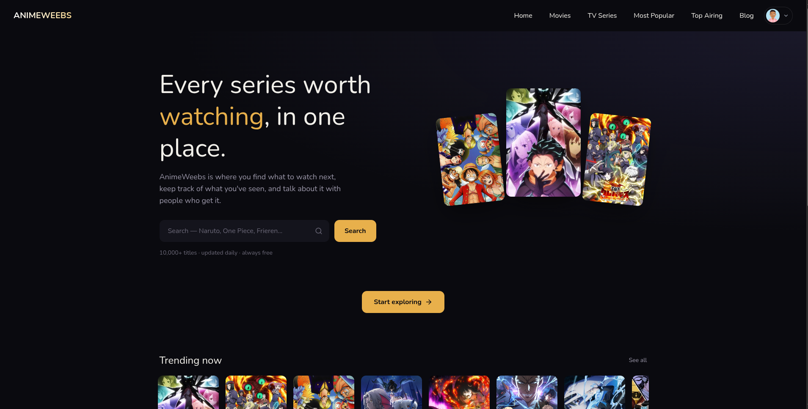
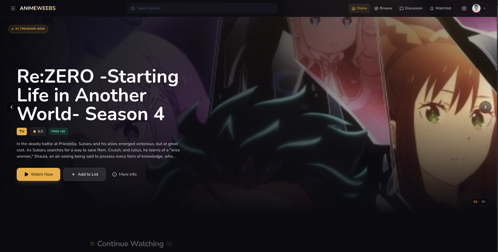
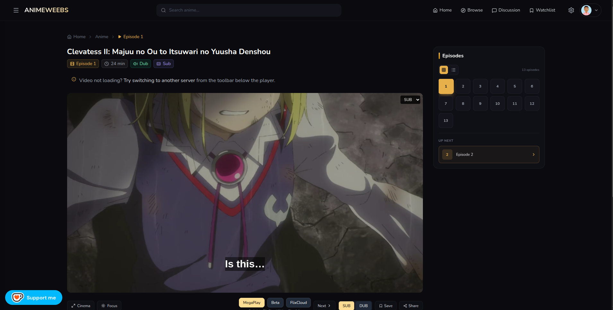
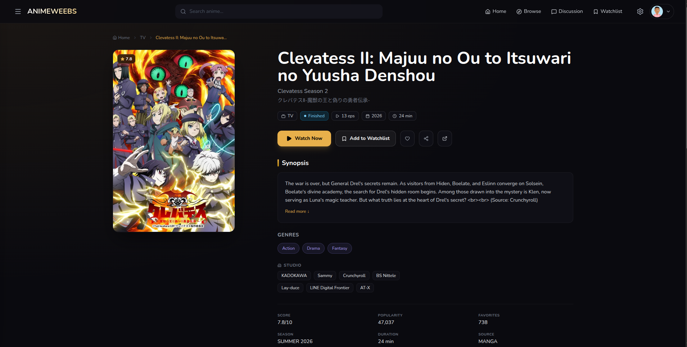
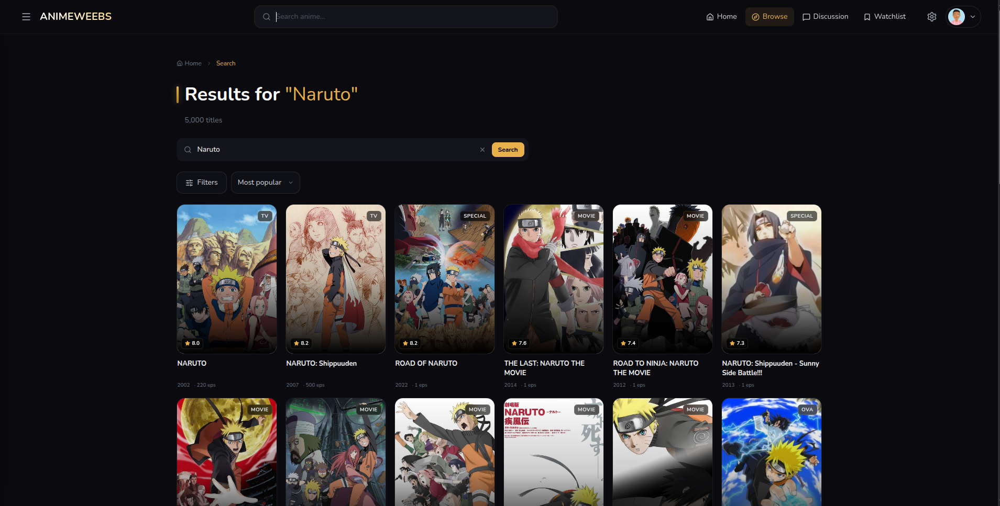
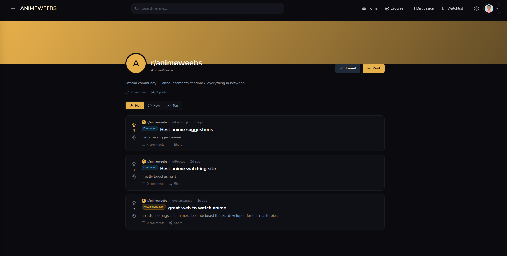
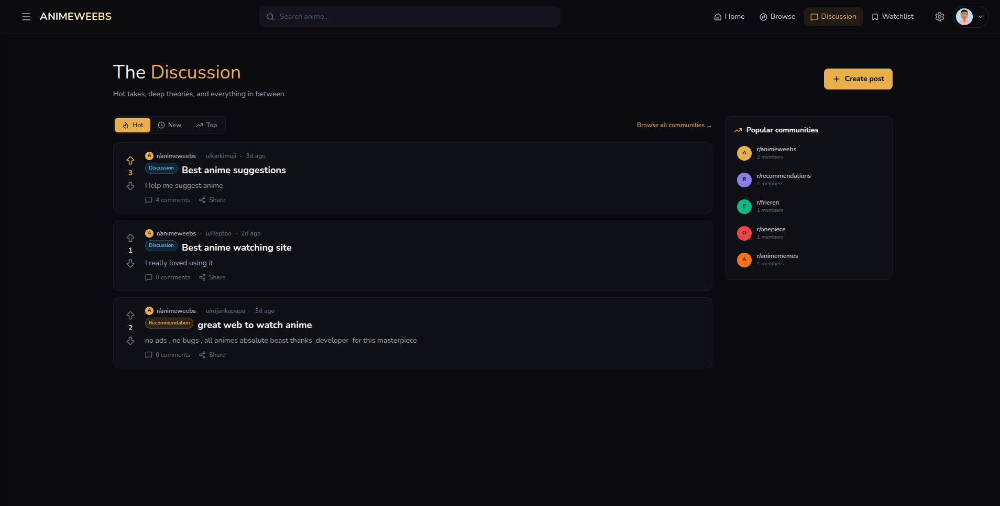
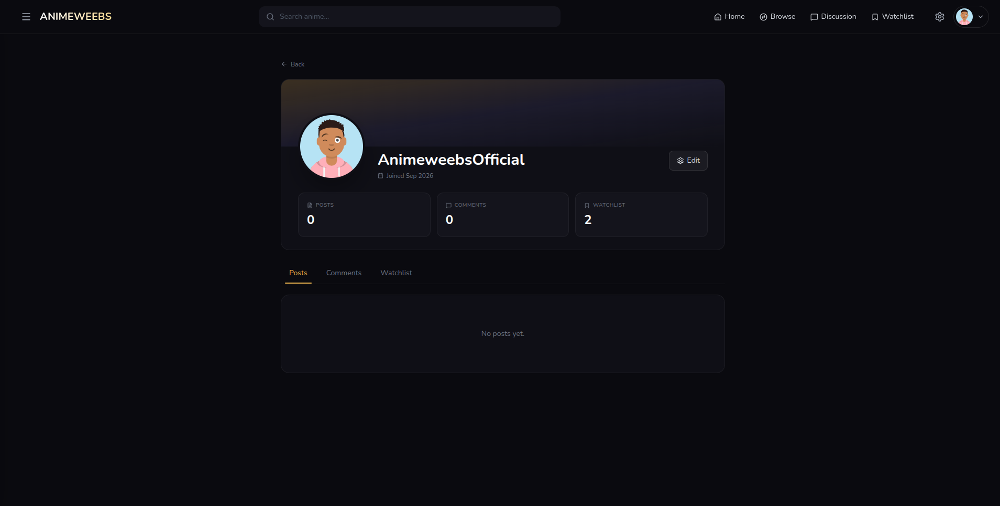
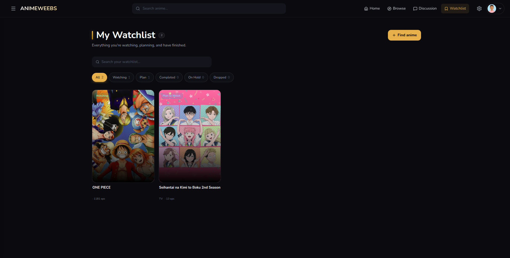
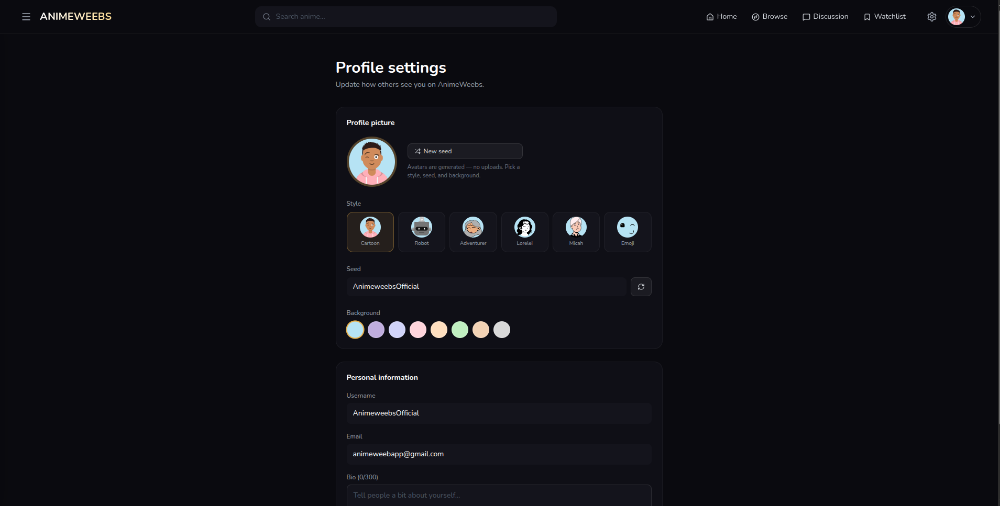

# AnimeWeebs

AnimeWeebs is a modern anime streaming and discovery web application that allows users to explore trending anime, view detailed information, and stream episodes seamlessly.

---

## Features

1. **Home Page**

   * Spotlight anime
   * Trending shows
   * Latest episodes
   * Upcoming anime
   * Popular and featured sections

2. **Anime Details Page**

   * Full anime information
   * Synopsis
   * Episode count (Sub/Dub)
   * Ratings and metadata
   * Related anime

3. **Video Streaming**

   * Smooth video playback
   * Episode navigation
   * Responsive player
   * Fast loading

---

---

## Preview

### 🏠 Home

---

### Watch anywhere. Talk about everything.

<table>
  <tr>
    <td width="50%">
      
      
<b>Cinematic home with trending rails</b>

    </td>
    <td width="50%">
      
      
<b>Multi-server player with comments</b>

    </td>
  </tr>
</table>

---

### Watch Page

### Anime Detail

### Search & Filters

### Community

### Threaded Discussion

### Profile

### Watchlist

### Auth

### Mobile

  

---

## Tech Stack

* **Frontend:** React, Tailwind CSS
* **Backend:** Node.js (API scraping & data handling)
* **Scraping:** Cheerio
* **Routing:** React Router
* **SEO:** React Helmet
* **UI Enhancements:** Swiper, Infinite Scroll

---

## Team Members

This project was created and developed by:

* **Rojan** – *Team Leader & Full Stack Developer*
* **Sweekar** – *Frontend Developer*
* **Keshav** – *Backend Developer*

---

## Project Goal

To build a fast, responsive, and user-friendly anime streaming platform that provides high-quality content browsing and streaming experience.

---

## Status

🚧 Currently under active development.

Note: This project is for educational and portfolio purposes. Please support the official releases of the anime you enjoy.
